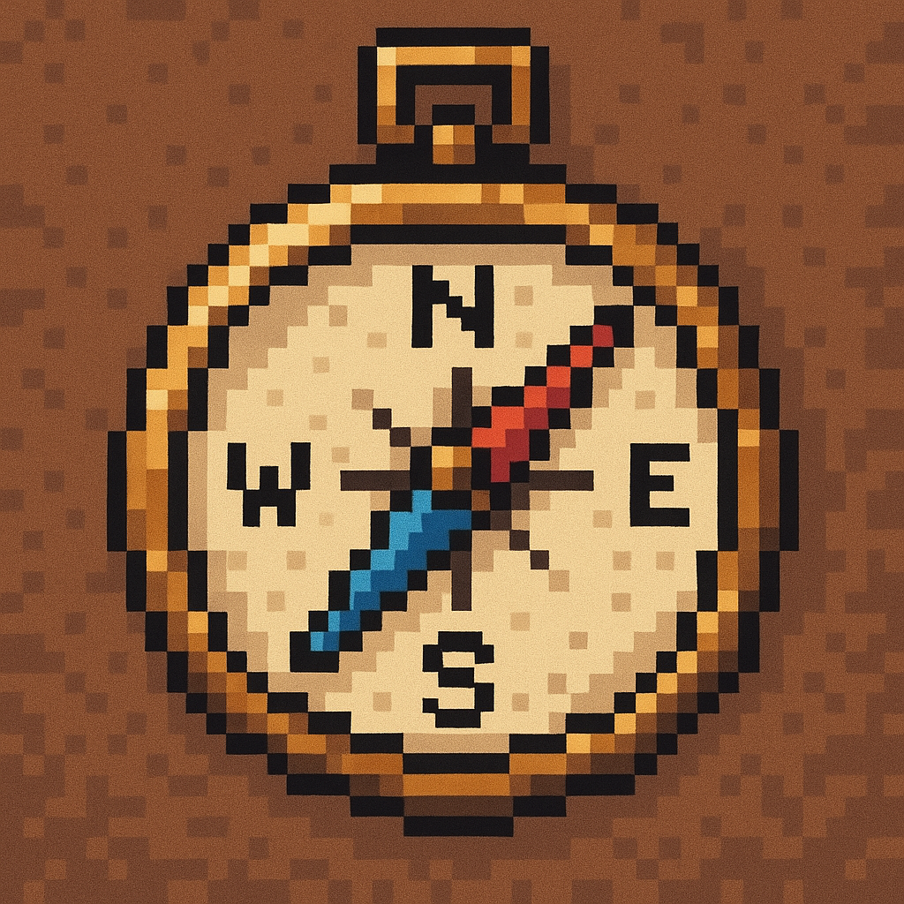

## About Me

I'm a software developer who combines art, design, and code to build functional and visually compelling digital projects.

## Skills

- **Languages:** JavaScript, TypeScript, Python, Java, C#
- **Frontend:** React, React Native, NextJs, HTML5, CSS3, SASS, Redux, Zustand
- **Backend:** Node.js, Express, Flask
- **Databases:** PostgreSQL, MongoDB, Redis, PLpgSQL, Supabase, Firebase
- **Tools:** Git, Docker, AWS, Linux

## Contact

- **Email:** [dangol.anish001@gmail.com]
- **LinkedIn:** [https://www.linkedin.com/in/dangol-anish/]
- **Portfolio:** [https://www.dangolanish.com.np/]

---

  

